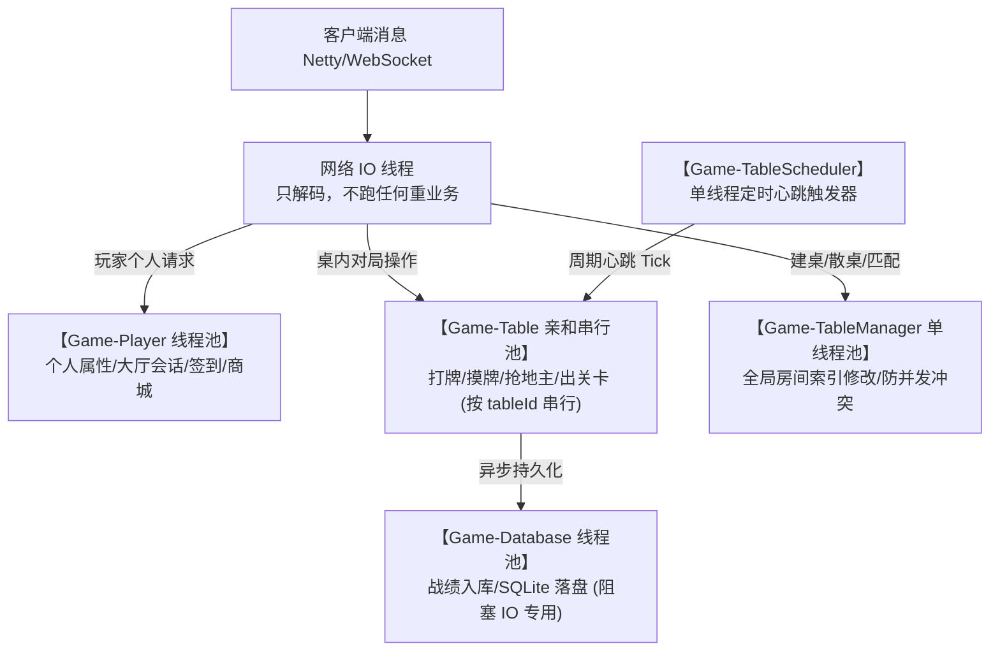
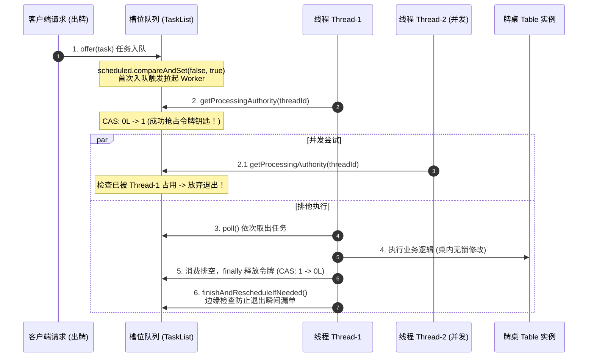

# threadtutil 线程与亲和并发调度机制说明

`threadtutil` 是 `utils` 模块内的核心通用线程调度与定时工具包，广泛应用于 `hub`（一体化服务）及底层网关、大厅与游戏模块。

本文档详细拆解 Hub 服务中的**线程分流模型、单桌串行无锁架构、工作窃取（Work-Stealing）机制以及慢任务卡死告警体系**。

---

## 目录
- [一、Hub 全局线程分流架构](#一hub-全局线程分流架构)
- [二、单桌串行（Serial Execution）机制图解](#二单桌串行serial-execution机制图解)
- [三、工作窃取（Work-Stealing）机制图解](#三工作窃取work-stealing机制图解)
- [四、慢任务告警与卡死现场抓取](#四慢任务告警与卡死现场抓取)
- [五、外部统一调用 API 规范](#五外部统一调用-api-规范)
- [六、避坑准则与常见问题](#六避坑准则与常见问题)

---

## 一、Hub 全局线程分流架构

Hub 进程通过 `GameThreadPoolManager` 统筹四类物理线程池与单线程调度器，实现**网络 IO、桌内对局、玩家会话、全局索引与数据库落盘的彻底物理隔离**，杜绝相互阻塞。

### 1. 架构拓扑图



### 2. 线程资源分配与职责

| 线程池名称 | 类型与配置 | 核心职责 | 绝不允许的行为 |
| :--- | :--- | :--- | :--- |
| **`Game-Table`** | `ExecutorPool`<br/>32 线程, 10万容量有界队列 | **牌桌领域状态机**：所有桌内出牌、摸牌、状态轮转、离桌结算 | **严禁任何阻塞 IO**（如查数据库、网络 RPC、Thread.sleep） |
| **`Game-Player`** | `ExecutorPool`<br/>32 线程, 10万容量有界队列 | 玩家个人背包、大厅交互、签到等用户维度并发事务 | 严禁直接修改桌子内部状态 |
| **`Game-TableManager`** | `ExecutorPool`<br/>**单物理线程**, 10万容量 | 牌桌生命周期管理、全局桌号生成、跨桌匹配、房间列表快照 | 严禁执行复杂耗时的对局逻辑 |
| **`Game-Database`** | `ExecutorService`<br/>固定线程池（默认 4~8 线程） | 战绩持久化、SQLite 异步写入、历史回放日志落盘 | 严禁与桌内状态同步调用绑定 |
| **`Game-TableScheduler`**| `ScheduledExecutorService`<br/>**单物理线程** | 固定频率心跳触发器（仅产生 tick 脉冲，立即投回 TablePool） | 严禁在调度线程内直接执行任何业务逻辑 |

---

## 二、单桌串行（Serial Execution）机制图解

### 1. 为什么必须单桌串行？
牌桌（Table）是典型的有状态聚合根。若两个玩家同时出牌，或在心跳结算瞬间又有玩家离桌，传统加锁（`synchronized / Lock`）极易引发死锁与剧烈的线程上下文切换。

`ExecutorPool` 借鉴 **Actor / Mailbox 机制**：**“桌内状态绝对不加排他锁，所有同一桌的任务全部按哈希映射到同一槽位无锁队列，任意时刻仅由一个 Worker 物理线程排他执行。”**

### 2. 内存模型与槽位映射图

```text
【业务桌子】                       【任务队列槽位 (taskLists)】              【底层物理线程池】
 
 +--------------+
 | 桌子 1000 号 | --(floorMod 取模 0)--> [ 槽位 0 : TaskList ] <========= [ 线程 Thread-1 ]
 +--------------+                        | [任务A] -> [任务B]   |               (持有令牌，排他消费槽位 0)
                                         +---------------------+
 +--------------+
 | 桌子 1001 号 | --(floorMod 取模 1)--> [ 槽位 1 : TaskList ] <========= [ 线程 Thread-2 ]
 +--------------+                        | [任务C]              |               (持有令牌，排他消费槽位 1)
                                         +---------------------+
 +--------------+
 | 桌子 1002 号 | --(floorMod 取模 2)--> [ 槽位 2 : TaskList ]              [ 线程 Thread-3 ]
 +--------------+                        | [任务D] -> [任务E]   |               (空闲，正发起工作窃取)
                                         +---------------------+
                                         [ 槽位 3 : TaskList ]              [ 线程 Thread-4 ]
                                         | (空队列)            |               (空闲)
                                         +---------------------+
```

### 3. 单槽排他执行时序流程



---

## 三、工作窃取（Work-Stealing）机制图解

### 1. 核心定义：窃取的是“队列”，不是“单个任务”
> [!IMPORTANT]
> **绝对准则**：系统绝不会从“正被其他线程处理”的队列中偷取单个任务，否则会破坏单桌串行。
> **窃取的真正含义**：**闲置线程主动去接管【积压了任务、但当前完全无线程在处理的空闲队列】**。

### 2. 工作窃取运转场景图

```text
 假设此时：
  - 线程 Thread-1 刚跑完了【槽位 0】的所有任务，变成空闲；
  - 槽位 1 正在被 Thread-2 消费 (isBusy = true)；
  - 槽位 2 堆积了 2 个任务，但由于线程池调度延迟，暂无线程进入 (isBusy = false)；
  - 槽位 3 为空队列。

 [ 线程 Thread-1 ] 结束槽位 0 后，立即发起环形巡视：
 
   巡视第 1 站：【槽位 1】
   [ 槽位 1 ] ------------> 发现：Thread-2 正在忙碌 (isBusy=true)
                            处理：Thread-1 礼貌路过，绝不插手！
 
   巡视第 2 站：【槽位 2】
   [ 槽位 2 ] ------------> 发现：有堆积任务 (isNotEmpty) 且 无人处理 (!isBusy)
                            动作：Thread-1 抢下槽位 2 的处理权令牌！
                                  整槽接管并全部消费掉（这就是窃取）！
 
   巡视第 3 站：【槽位 3】
   [ 槽位 3 ] ------------> 发现：是空的队列 (isEmpty)
                            处理：跳过。
```

---

## 四、慢任务告警与卡死现场抓取

`ExecutorPool` 内置了两级执行时间雷达，杜绝任何因死循环、死锁或慢 SQL 拖死 Worker 线程的情况：

```text
 [任务开始执行]
       │
       ▼
 [耗时 > 5000ms]  ──► 触发一级告警：打印 ERROR 慢任务警告，输出 slot、持有线程 ID 及耗时
       │
       ▼
 [耗时 > 60000ms] ──► 触发二级快照：判定为严重死锁/卡死，直接抓取并 Dump 现场完整线程堆栈！
```

日志输出示例：
```log
2026-09-22 14:30:00 ERROR [ExecutorPool 慢任务警告] 槽位:3 处理时间过长! 持有线程:[15:Game-Table_3] 已持续耗时:5230ms
2026-09-22 14:31:00 ERROR 卡死线程堆栈 Dump [ID:15 Name:Game-Table_3]:
  at com.cloud.hub.game.domain.mj.MjPlayService.calculateFan(MjPlayService.java:188)
  at com.cloud.hub.game.domain.table.Table.tableLoop(Table.java:410)
  ...
```

---

## 五、外部统一调用 API 规范

经重构后，外部业务无需再自己声明内部类（如 `TableTask`），直接调用统一极简 API：

### 1. 业务端点（Controller / Handler）标准调用
```java
// 1. 同桌串行投递（传入 tableId 与 Lambda，自动返回 CompletableFuture）
table.execute(() -> {
    table.processPlayCard(userId, card);
});

// 2. 玩家个人会话串行投递（传入 userId 与 Lambda）
executorPool.serialExecute(userId, () -> {
    player.updateScore(100);
});

// 3. 普通非串行异步任务
executorPool.execute(() -> {
    logger.info("异步统计上报");
});
```

### 2. 周期调度与防堆积标准调用
```java
// 每 200ms 一拍，心跳任务内部自带 tickBusy 防堆积
ScheduledFuture<?> loop = pools.scheduleTable(tableId, table::tableLoop, 1000, 200);

// 停桌时取消调度
pools.cancelTableSchedule(loop);
```

---

## 六、避坑准则与常见问题

1. **同资源必须同 Key**：
   凡是修改同一桌子状态的操作（出牌、入桌、离桌、超时判定），必须传同一个 `tableId`，确保进入同一个串行槽位。
2. **串行任务里绝不跑阻塞 IO**：
   写数据库、调 HTTP/RPC、`Thread.sleep()` 必须投递到 `databasePool` 或另外异步处理，严禁阻塞槽位 Worker。
3. **队列满时的反压行为（CallerRuns）**：
   当队列超过有界容量（10 万）时，底层采用 `CallerRunsPolicy`，由提交方线程（如网络 IO 线程）直接代为执行。这会自然放慢网络接收速率，形成正向背压，保护服务端不发生 OOM。
4. **负数 groupId 安全性**：
   内部使用 `Math.floorMod(groupId, slots)`，完全兼容 `hashCode` 为负数或 `Integer.MIN_VALUE` 的情况，永不数组越界。
